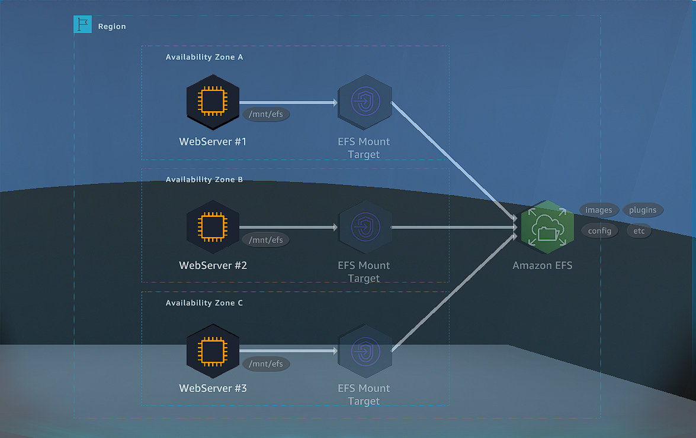
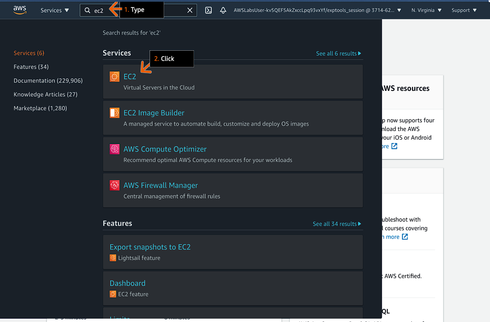

# Setup File System in the Cloud

## Learning Objectives

- Setup Amazone Elastic File System
- Create a mount target for the pet client photos repository

## Goals

### Practice Lab Goals

- Configure adn deploy an Amazone Elastic File System.
- Mount EFS in two EC2 Instances.

### DIY (Do It Yourselft) Goals

- Mount an EFS endpoint to the third EC2 Instance.
- Test if the file are accessible from the EC2 Instance.

# Practice for Lab Goals

## File Systsem in the Cloud using Amozone EFS

### Step 1

1. Review the lab objectives in the concepts field.
2. For practice you can use amzone free tier account.
3. Please follow the lab instructions carefully and use the arrows below to navigate between steps.

#### Concept

in the lab you will :

- Launch and configure an Amazone EFS file system.
- Mount the file system to an Amazone EC2 instance.
- Connect a second Amazone EC2 Instance to the same file system.
- Share file between the two Amazone EC2 instances.

### Step 2

1. In the Service search bar, type: `ec2`
2. Click EC2.
3. Go to the next step.

#### Concept

Amazone EFS provide a simple, service, set and forget, elastic file system that let you share file data without provisioning and manage storage.
