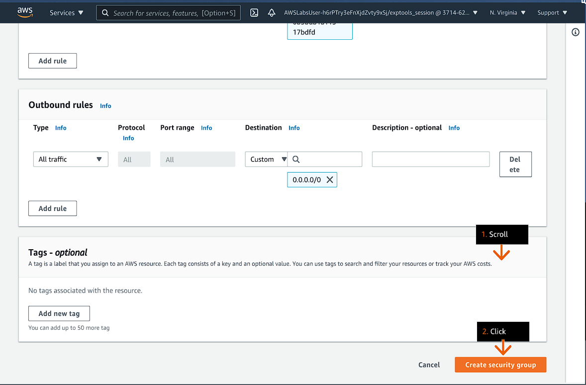
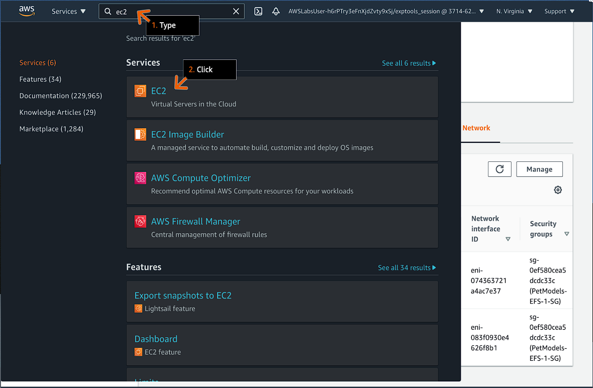

# Setup File System in the Cloud

## Learning Objectives

- Setup Amazon Elastic File System
- Create a mount target for the pet client photos repository

## Goals

### Practice Lab Goals

- Configure adn deploy an Amazon Elastic File System.
- Mount EFS in two EC2 Instances.

### DIY (Do It Yourselft) Goals

- Mount an EFS endpoint to the third EC2 Instance.
- Test if the file are accessible from the EC2 Instance.

# Practice for Lab Goals

## File Systsem in the Cloud using Amozone EFS

### Step 1

1. Review the lab objectives in the concepts field.
2. For practice you can use amzone free tier account.
3. Please follow the lab instructions carefully and use the arrows below to navigate between steps.

#### Concept

in the lab you will :

- Launch and configure an Amazon EFS file system.
- Mount the file system to an Amazon EC2 instance.
- Connect a second Amazon EC2 Instance to the same file system.
- Share file between the two Amazon EC2 instances.

### Step 2

1. In the Service search bar, type: `ec2`
2. Click EC2.
3. Go to the next step.

#### Concept

Amazon EFS provide a simple, service, set and forget, elastic file system that let you share file data without provisioning and manage storage.

### Step 3

1. On the left menu, click Instances.
2. Go to the next step.

#### Concept

With Amazon EFS, you can grow and shrink your file system automatically as you add adn remove files, eliminating the need to provision and manage capacity to accommodate growth.

### Step 4

1. Review the names of the three existing instances.
   - In this case : `first create 3 ec2 instance with separate availability zone each instance`
2. Scroll to the right.
3. Go to the next step

#### Concept

Amazon EFS creates a shared storage file system available concurrantly to multiple instance.

### Step 5

1. Under Availability Zone, review the Availability Zone for each instance.
2. On the left menu, click Security Groups.
3. Go to the next step.

#### Concept

After creating an Amazon EFS file system, you create mount target on each subnet. The mounts target enables communication from instances on the subnet. Amazon EFS file system uses the Network File System (NFSv4) protocol. Instances that connect to teh file system are NFS Client.

### Step 6

1. Review the webserver security group which is already linked to the web servers.
2. Click Create security group.
3. Go to the next step.

#### Concept

When you create an Amazon EFS mount target, you must attach a security group. The security groups determines which instances can access teh file system as NFS clients.

### Step 7

1. Under Security group name, type: `PetModels-EFS-1-SG`
2. Under Description, type: `Restrict access to webservers only`
3. Under VPC, choose PetModels.
   - You may need to remove the existing VPC by clicking X.
4. Under Inbound rules, click Add rule.
5. Go to the next step.

#### Concept

Security groups are linked to a single VPC. You can assign a security group to one or more instances, but each instance must be in the same VPC as the security group.

### Step 8

1. Under Type, choose NFS.
2. Under source, choose the webserver security group.
3. Go to the next step.

### Step 9

#### Consept

### Step 10

#### Consept

### Step 11

#### Consept

### Step 12

#### Consept

### Step 13

#### Consept

### Step 14

#### Consept

### Step 15

#### Consept

### Step 16

#### Consept

### Step 17

#### Consept

### Step 18

#### Consept

### Step 19

#### Consept

### Step 20

#### Consept

### Step 21

#### Consept

### Step 22

#### Consept

### Step 23

#### Consept

### Step 24

#### Consept

### Step 25

#### Consept

### Step 26

#### Consept

### Step 27

#### Consept

### Step 28

#### Consept

### Step 29

#### Consept

### Step 30

#### Consept

### Step 31

#### Consept

### Step 32

#### Consept

### Step 33

#### Consept

### Step 34

#### Consept

### Step 35

#### Consept

### Step 36

#### Consept

### Step 37

#### Consept

### Step 38

#### Consept

### Step 39

#### Consept

### Step 40

#### Consept

### Step 41

#### Consept

### Step 42
